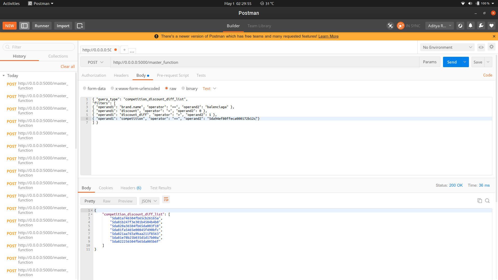

# Greendeck API

###Files:-
1. dumps: It contains json and csv file to be used in project.
2. main_code.py: This python file contains code.
3. requirements.txt: Required dependency.
4. image.png sample for post request.

## Working of main_code.py:-

* init_files function and prepare_dataset function generates json and csv file respectively and stores in dumps folder.

* master_function is target function. All other functions are routed according to post query from here.

* Created separate function for each task defined in problem statement with same name as of post query.

* Run main_code.py file to start server.

## POST Request Example:-

